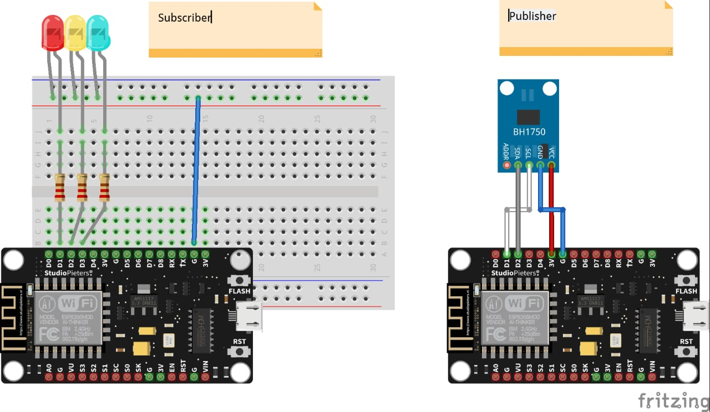

# PROJECT AKHIR - KELOMPOK 3 - PRAKTIKUM - IOT - UNMUL

**Nama & NIM Anggota Kelompok**
1. Muhammad Irvan Hakim 	(2109106057)
2. Muhammad Dhimas Eko Wiyono 	(2109106068)
3. Maulana Muhammad Hafidz 	(2109106070)
4. Abdullah Mustaqim 		(2109106134)

**Judul Project Akhir**
_Sistem IoT Untuk Monitoring dan Kontrol Led Automatis Menggunakan Sensor Intensitas Cahaya (Telegram)_

**Deskripsi**
Sistem ini dirancang untuk memberikan solusi otomatis dalam mengontrol pencahayaan berdasarkan kondisi lingkungan. Sistem dapat menyesuaikan lampu LED secara efisien, sehingga dapat menghemat energi dan meningkatkan kenyamanan pengguna. Selain itu, aplikasi Telegram memungkinkan pengguna untuk memantau dan mengendalikan sistem dari jarak jauh. Sistem ini memanfaatkan teknologi Internet of Things (IoT) untuk memantau dan mengontrol secara otomatis lampu LED berdasarkan intensitas cahaya yang terdeteksi oleh sensor. Pada project ini user dapat melakukan :
1. User dapat melihat jumlh intensitas cahaya saat ini
2. User dapat melihat status LED
3. User dapat melihat batas intensitas cahaya setiap LED
4. User dapat mengatur batas intensitas cahaya setiap LED

**Pembagian Tugas**
1. Muhammad Irvan Hakim 	: Membuat Program Publisher
2. Muhammad Dhimas Eko Wiyono 	: Membuat schematic & merakit komponen 
3. Maulana Muhammad Hafidz 	: Melakukan set up bot telegram & merakit komponen
4. Abdullah Mustaqim		: Membuat Program Subscriber

**Komponen yang Digunakan**
1. Esp8266 (2 buah)
2. Kabel Jumper (5 buah)
3. BH1750 (1 buah)
4. Resistor (3 buah)
5. Bread board (1 buah)
6. Lampu LED (3 buah)
7. Kabel USB (2 buah)

**Board Schematic**

